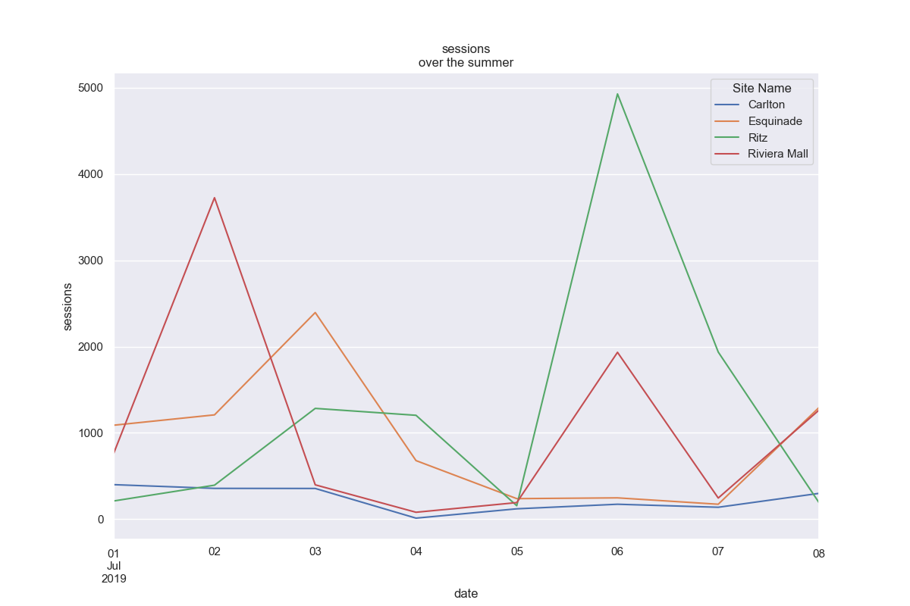

---
jupytext:
  text_representation:
    extension: .md
    format_name: myst
kernelspec:
  display_name: Python 3 (ipykernel)
  language: python
  name: python3
language_info:
  name: python
  nbconvert_exporter: python
  pygments_lexer: ipython3
---

# dessins par groupby

et accessoirement, lire plusieurs feuillets depuis excel

{download}`mais commencez par télécharger le zip<./ARTEFACTS-groupby-draw.zip>`

+++

le fichier excel `data/groupby-draw.xlsx` contient ici plusieurs feuillets

+++

```{image} media/groupby-draw-excel.png
:align: center
```

+++

les deux feuillets contiennent 2 données différentes pour les mêmes sites / dates

+++

## ce qu'il faut faire

+++

A. visualiser les deux données (Sessions et Waiters) en fonction du temps par site

e.g.



+++

B. mêmes chiffres mais agrégés sur les sites, les deux caratéristiques sur une seule figure (ici avec seaborn)


```{code-cell} ipython3
# à vous

# imports ...
```

```{code-cell} ipython3
df = ...
```

---
